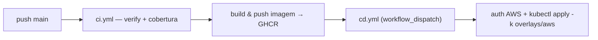

# `.github` — CI/CD (GitHub Actions)

Automação de build, testes e deploy do `workshop-service`.

## Workflows

| Arquivo | Gatilho | O que faz |
|---|---|---|
| [`workflows/ci.yml`](workflows/ci.yml) | push / PR na `main` | `./mvnw verify` (testes unitários + integração via Testcontainers + gate de cobertura **≥80%** no JaCoCo). Em push na `main`, também faz **build e push** da imagem para o **GHCR** (`sha-<sha>` + `latest`). |
| [`workflows/cd.yml`](workflows/cd.yml) | `workflow_dispatch` | Deploy no **EKS** (AWS Academy): autentica na AWS (credenciais temporárias com *session token*), gera o kubeconfig, cria o `workshop-secret`, injeta o endpoint do RDS e aplica `k8s/overlays/aws`, seta a tag imutável da imagem e aguarda o rollout. |

## Secrets & Variables

Os nomes consumidos pela pipeline (e como obter cada valor) estão documentados em
[`deploy.env.example`](deploy.env.example) — **template, sem valores reais**.

- **Secrets** (`gh secret set NOME` ou *Settings → Secrets and variables → Actions*):
  `AWS_ACCESS_KEY_ID`, `AWS_SECRET_ACCESS_KEY`, `AWS_SESSION_TOKEN`, `DB_HOST`, `DB_USER`,
  `DB_PASSWORD`, `JWT_SECRET`, `WEBHOOK_ORCAMENTO_TOKEN`, `MAIL_USERNAME`, `MAIL_PASSWORD`.
- **Variables** (não sensível): `AWS_REGION` (`us-east-1`), `EKS_CLUSTER_NAME` (`workshop-eks`).

> ⚠️ As credenciais do **AWS Academy** são temporárias (expiram ao reiniciar a sessão do lab).
> Ao renovar a sessão, reconfigure `AWS_ACCESS_KEY_ID`, `AWS_SECRET_ACCESS_KEY` e
> `AWS_SESSION_TOKEN` antes de disparar o CD. Nunca commite valores reais — os Secrets do Actions
> são *write-only*.
