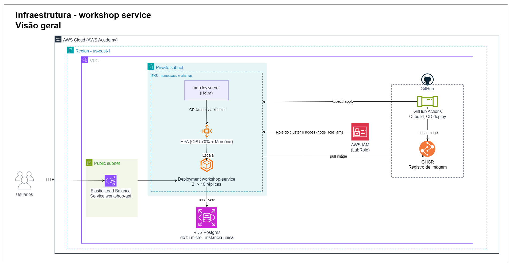
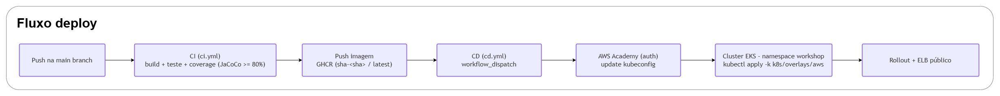

# Workshop Service — Fase 2

> Evolução do back-end de gestão de oficinas mecânicas com foco em **qualidade, resiliência e escalabilidade**: Clean Architecture, containerização, orquestração em Kubernetes, Infraestrutura como Código (Terraform) e pipeline de CI/CD.

---

## Sobre a solução

O **Workshop Service** é a API REST que digitaliza os processos operacionais de uma oficina mecânica — clientes, veículos, peças/insumos, estoque, ordens de serviço, orçamentos e execução.

Na **Fase 1** a entrega foi um MVP de back-end estruturado com DDD e arquitetura em camadas. Na **Fase 2**, a aplicação evolui para operar com **alta disponibilidade e escalabilidade dinâmica**, incorporando práticas modernas de infraestrutura e automação:

- **Refatoração** seguindo Clean Code + Clean Architecture (separação estrita de camadas e dependências).
- **Containerização** via Docker + `docker compose` para desenvolvimento local.
- **Orquestração** em Kubernetes (Deployments, Services, ConfigMaps/Secrets e **HPA** por CPU e memória).
- **Infraestrutura como Código** com Terraform (cluster **EKS** + banco **RDS** na AWS).
- **CI/CD** com GitHub Actions (build, testes, cobertura, build/push da imagem no GHCR e deploy no cluster).

### Objetivos desta fase

| Objetivo (Tech Challenge) | Como é atendido |
|---|---|
| Reduzir riscos operacionais com infra escalável | EKS multi-nó + HPA (2→10 réplicas) + RDS gerenciado |
| Automatizar provisionamento e deploy | Terraform (`infra/`) + pipeline CI/CD (`.github/workflows/`) |
| Qualidade e organização do código | Clean Architecture + testes (unit + integração) + cobertura mínima 80% (JaCoCo) |
| Suportar picos de ordens de serviço | Escalabilidade horizontal automática via HPA por consumo de CPU e memória |

---

## Arquitetura proposta

### Componentes da aplicação

A API segue **Clean Architecture** — dependências sempre apontam para o domínio, que é puro (sem Spring).

```text
src/main/java/com/postech/workshop_service/
├── api/              → Controllers REST + DTOs        (entrada HTTP)
├── application/      → Use Cases                       (regras de negócio, 1 arquivo por ação)
├── domain/           → Entidades, Value Objects, Enums, interfaces de repositório (puro)
└── infrastructure/   → JPA Entities, Mappers, Spring Data repos, RepositoryImpl, config
```

Principais capacidades expostas: abertura e consulta de **Ordem de Serviço**, aprovação/recusa de **orçamento** (webhook externo), **listagem** de OS ordenada por status (exclusão lógica das finalizadas/entregues) e **atualização de status** com notificação.

### Infraestrutura provisionada (AWS)


> Diagrama com visão detalhada se encontra na imagem: [Infra fluxo](docs/infra/images/workshop_infra-infraestrutura-fluxo.drawio.png)

- **Cluster:** Amazon **EKS** (`workshop-eks`), node group com EC2 (t3.medium), `metrics-server` para o HPA (CPU + memória).
- **Banco:** Amazon **RDS PostgreSQL** (`workshop-db`), fora do cluster (não é Postgres in-cluster).
- **Exposição:** `Service type=LoadBalancer` → o cloud-controller do EKS provisiona um **ELB** público.
- **Registry:** imagem publicada no **GHCR** (GitHub Container Registry) — o EKS puxa de lá.
- **Provisionamento:** tudo em `infra/eks` via Terraform, adaptado ao **AWS Academy Learner Lab** (reusa a `LabRole`).

### Fluxo de deploy (CI/CD)


> Diagrama com visão detalhada se encontra na imagem: [Deploy etapas](docs/infra/images/workshop_infra-deploy-etapas.drawio.png)

1. **CI** (`.github/workflows/ci.yml`) — em push/PR na `main`: `./mvnw verify` (testes unitários + integração via Testcontainers + gate de cobertura 80%). Em push na `main`, também faz **build e push da imagem** para o GHCR.
2. **CD** (`.github/workflows/cd.yml`) — `workflow_dispatch`: autentica na AWS Academy (credenciais temporárias com *session token*), gera o kubeconfig do EKS, cria o `workshop-secret`, injeta o endpoint do RDS e aplica o overlay `aws` do Kustomize, seta a tag imutável da imagem e aguarda o rollout.

> Os nomes/segredos necessários no CI/CD estão documentados em [`.github/deploy.env.example`](.github/deploy.env.example).

---

## Como executar

### 1. Execução local (Docker Compose)

Pré-requisitos: **Java 21**, **Maven 3.9+**, **Docker Desktop** ativo.

```bash
# sobe app + Postgres (e dependências) via compose
./mvnw spring-boot:run        # sobe o docker-compose automaticamente
# ou manualmente:
docker compose up -d
```

A aplicação fica em `http://localhost:8080`. Copie `.env.example` para `.env` para ajustar credenciais locais.
Defina o `JWT_SECRET` (mín. 32 chars) antes de subir a API — sem ele o startup falha por segurança:

```bash
export JWT_SECRET="$(openssl rand -hex 32)"
```

Health check e testes:

```bash
curl http://localhost:8080/actuator/health
./mvnw verify                 # testes + cobertura + formatação
```

### 2. Provisionamento da infraestrutura (Terraform)

O cluster **EKS + RDS** é provisionado em [`infra/eks`](infra/eks/README.md). Requer credenciais do **AWS Academy** (temporárias, com `aws_session_token`).

```bash
cd infra/eks
cp terraform.tfvars.example terraform.tfvars      # define db_password (não commitar)
terraform init
terraform apply                                   # VPC + EKS (LabRole) + RDS + metrics-server
aws eks update-kubeconfig --name workshop-eks --region us-east-1
terraform output                                  # db_host, db_username, cluster_name...
```

> No **AWS Academy** (sandbox de estudo com crédito limitado), derrube o ambiente com `terraform destroy` após a demonstração — isso é uma restrição do lab, **não** parte do fluxo de deploy: em produção a infraestrutura permanece de pé. Detalhes e a variante **local com `kind`** em [`infra/README.md`](infra/README.md).

### 3. Deploy em Kubernetes

Manifestos em [`k8s/`](k8s/README.md), organizados com **Kustomize** (base + overlays):

```bash
# AWS (EKS + RDS) — geralmente via pipeline CD, mas manualmente:
kubectl apply -k k8s/overlays/aws
kubectl -n workshop rollout status deployment/workshop-service

# DEV local (kind/minikube) — sobe app + Postgres in-cluster de uma vez:
kubectl apply -k k8s/overlays/dev
kubectl -n workshop port-forward svc/workshop-service 8080:8080
```

O `workshop-secret` (credenciais sensíveis) **não** é versionado — é criado no deploy a partir dos outputs do Terraform / GitHub Secrets. Ver [`k8s/README.md`](k8s/README.md) e [`k8s/overlays/aws/README.md`](k8s/overlays/aws/README.md).

**Escalabilidade automática (HPA):**

```bash
kubectl -n workshop get hpa workshop-service -w   # REPLICAS sobem sob carga de CPU/memória (2→10)
```

---

## Documentação da API

- **Swagger UI** (local): `http://localhost:8080/swagger-ui/index.html`
- **Contrato OpenAPI** versionado: [`openapi.yaml`](openapi.yaml)
- **Collection (Postman/Insomnia):** `<LINK_COLLECTION_API_AQUI>`

---

## Tecnologias

### Backend
[](https://www.java.com/) [](https://spring.io/projects/spring-boot) [](https://spring.io/projects/spring-security)

### Qualidade e Testes
[](https://junit.org/junit5/) [](https://site.mockito.org/) [](https://testcontainers.com/) [](https://www.jacoco.org/)

### Banco de Dados
[](https://www.postgresql.org/) [](https://flywaydb.org/)

### Infra & DevOps
[](https://www.docker.com/) [](https://kubernetes.io/) [](https://www.terraform.io/) [](https://aws.amazon.com/eks/) [](https://github.com/features/actions)

---

## Segurança

- Autenticação baseada em **JWT** (segredo obrigatório via `JWT_SECRET`).
- Estrutura preparada para **RBAC**. Detalhes: [Fluxo de autenticação e autorização JWT](docs/autenticacao-jwt-rbac/README.md).
- Segredos (banco, tokens de serviços externos) via **Kubernetes Secret** / **GitHub Secrets** — nunca versionados.

---

## Artefatos e documentação

- [Linguagem Ubíqua](docs/linguagem-ubiqua/dicionario_linguagem_ubiqua_completo.pdf)
- [Domain Storytelling](docs/domain_storytelling)
- [Event Storming](docs/event_storming/README.md)
- [Fluxo JWT e RBAC](docs/autenticacao-jwt-rbac/README.md)
- **Infra (Terraform):** [`infra/README.md`](infra/README.md) · [`infra/eks/README.md`](infra/eks/README.md)
- **Kubernetes:** [`k8s/README.md`](k8s/README.md)

---

## Vídeo demonstrativo

Demonstra deploy da aplicação, execução do CI/CD, consumo das APIs e escalabilidade automática (até 15 min).

▶️ `<LINK_DO_VIDEO_AQUI>`

---

## Equipe

Projeto desenvolvido como parte do Tech Challenge da POSTECH — Turma 15SOAT.

<p align="center">
<a href="https://github.com/jeanrabello" title="@jeanrabello"></a>&nbsp;&nbsp;&nbsp;
<a href="https://github.com/MahAmorim" title="@MahAmorim"></a>&nbsp;&nbsp;&nbsp;
<a href="https://github.com/tassyo" title="@tassyo"></a>&nbsp;&nbsp;&nbsp;
<a href="https://github.com/ssayori" title="@ssayori"></a>&nbsp;&nbsp;&nbsp;
<a href="https://github.com/mateus-paz" title="@mateus-paz"></a>
</p>

<p align="center">
<sub>
Jean Paes Rabello • Marcela Amorim • Tassyo Monteiro • Suzana Sayori • Mateus Paz de Oliveira
</sub>
</p>

---

<p align="center">
  <sub>Desenvolvido pelo Grupo 274 • Turma 15SOAT • POSTECH</sub>
</p>
