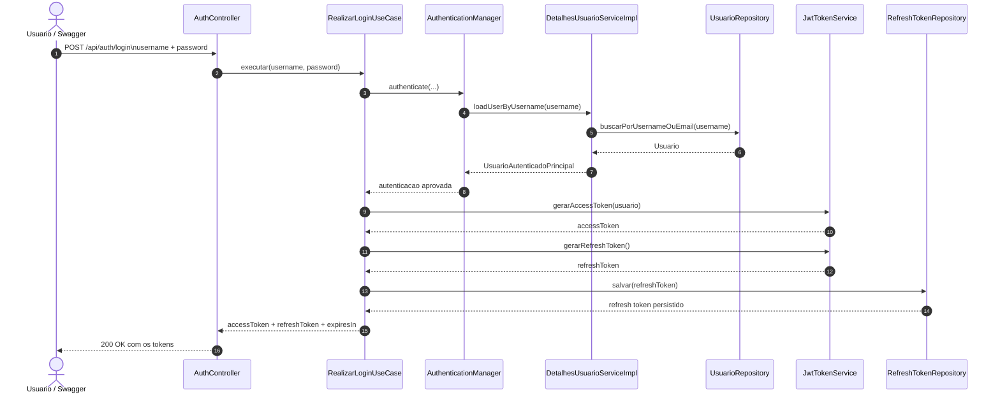
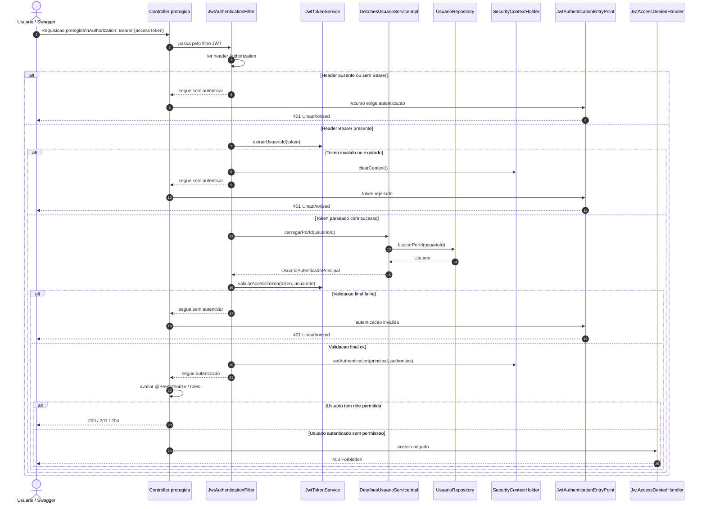
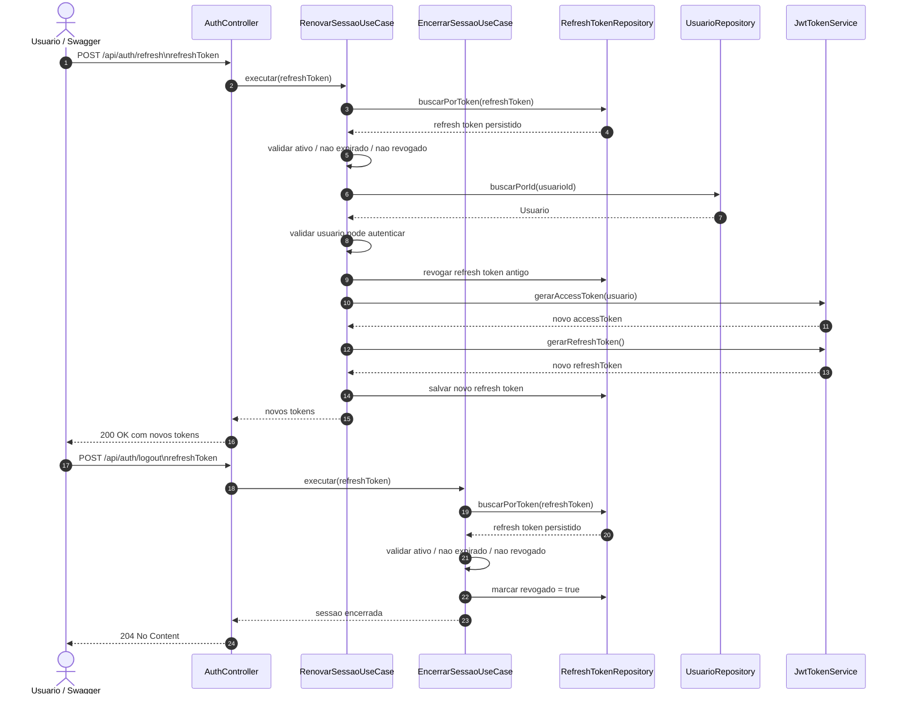

# Autenticacao e Autorizacao JWT

Este documento descreve o fluxo implementado hoje no projeto para autenticacao, renovacao de sessao e controle de acesso por perfil.

O foco aqui nao e a spec original, e sim o comportamento que o codigo efetivamente entrega agora.

## Referencia Visual

Os fluxos abaixo foram separados em diagramas menores para facilitar a leitura:

- [Fluxo 1: login e emissao de tokens](./01-login.mmd)
- [Fluxo 2: validacao do access token em rota protegida](./02-validacao-access-token.mmd)
- [Fluxo 3: refresh token e logout](./03-refresh-logout.mmd)

### Fluxo 1: login e emissao de tokens



### Fluxo 2: validacao do access token em rota protegida



### Fluxo 3: refresh token e logout



## Visao Geral

A autenticacao foi implementada com:

- `access token` JWT stateless
- `refresh token` opaco persistido no banco
- Spring Security com `SecurityFilterChain` stateless
- autorizacao por role com `@PreAuthorize`

Roles atualmente suportadas:

- `ADMINISTRADOR`
- `ATENDENTE`
- `MECANICO`
- `CLIENTE`

No Spring Security, cada role vira uma authority no formato `ROLE_<ROLE>`.

## O Que Foi Implementado

- `POST /api/auth/login`
- `POST /api/auth/refresh`
- `POST /api/auth/logout`
- `GET /api/auth/me`
- filtro JWT para popular o `SecurityContextHolder`
- persistencia de `usuarios`, `usuarios_roles` e `refresh_tokens`
- protecao de endpoints com `401` para nao autenticado e `403` para autenticado sem permissao
- endpoint de escopo proprio do cliente em `GET /api/v1/clientes/me`

## O Que Nao Foi Implementado

- nao existe endpoint HTTP para criar usuarios
- nao existe endpoint HTTP para gerenciar usuarios, resetar senha, bloquear conta ou atribuir roles
- nao existe blacklist de `access token`
- nao existem ainda endpoints de ordem de servico para materializar todas as permissoes previstas para `MECANICO` e `CLIENTE`

Isso afeta diretamente a resposta para "quem pode criar usuarios": hoje isso nao existe via API.

## Modelo Atual de Usuario

O usuario autenticavel fica na tabela `usuarios` e tem apoio das tabelas `usuarios_roles` e `refresh_tokens`.

Campos principais:

- `id`
- `username` unico
- `email` unico quando informado
- `senha_hash`
- `cliente_id`
- `ativo`
- `bloqueado`

Regras de dominio implementadas:

- todo usuario precisa ter pelo menos uma role
- `CLIENTE` exige `cliente_id`
- usuario sem role `CLIENTE` nao pode ter `cliente_id`
- `username` e `email` sao unicos
- a senha precisa ser armazenada como hash BCrypt
- um `cliente_id` so pode estar vinculado a uma conta de usuario

## Como Um Usuario E Criado Hoje

Hoje o projeto nao expoe `POST /api/usuarios` nem qualquer fluxo administrativo equivalente.

Na pratica, um usuario so pode ser criado de uma destas formas:

- insercao direta no banco
- seed/manual bootstrap
- uso interno de repositorio em codigo Java

Entao, a resposta objetiva e:

- **via API**: ninguem, porque o endpoint nao existe
- **via banco/codigo interno**: qualquer operador com acesso operacional ao ambiente

### Exemplo de criacao manual no banco

```sql
INSERT INTO usuarios (
    id,
    username,
    email,
    senha_hash,
    cliente_id,
    ativo,
    bloqueado
) VALUES (
    gen_random_uuid(),
    'admin',
    'admin@teste.com',
    '<hash-bcrypt>',
    NULL,
    true,
    false
);

INSERT INTO usuarios_roles (usuario_id, role)
SELECT id, 'ADMINISTRADOR'
FROM usuarios
WHERE username = 'admin';
```

Para conta `CLIENTE`, o `cliente_id` deve apontar para um registro existente em `clientes`.

## Como O Login Funciona

Endpoint:

- `POST /api/auth/login`

Payload:

```json
{
  "username": "admin",
  "password": "senha123"
}
```

Observacao importante:

- o campo continua se chamando `username`
- ele aceita **username ou email**

### Passo a passo real

1. O controller chama `RealizarLoginUseCase`.
2. O use case delega para o `AuthenticationManager`.
3. O `DaoAuthenticationProvider` usa `DetalhesUsuarioServiceImpl`.
4. O `DetalhesUsuarioServiceImpl` busca usuario por `username` ou `email`.
5. O Spring compara a senha com `BCryptPasswordEncoder`.
6. Se autenticar, o sistema busca o usuario de dominio pelo `id`.
7. O sistema gera um `access token` JWT.
8. O sistema gera um `refresh token` opaco.
9. O `refresh token` e persistido em `refresh_tokens`.
10. A API devolve os dois tokens.

### Quando o login falha

- credencial errada: `401`
- conta desabilitada ou bloqueada: `401`
- usuario inexistente: `401`

## Estrutura Do Access Token

O JWT emitido contem:

- `sub`: `id` do usuario
- `username`
- `roles`
- `iat`
- `exp`

Configuracao atual em `application.yml`:

- `access token`: `3600` segundos
- `refresh token`: `7` dias

## Como O Access Token E Validado

Para rotas protegidas:

1. O cliente envia `Authorization: Bearer <token>`.
2. `JwtAuthenticationFilter` extrai o token.
3. O filtro le o `sub` e carrega o usuario por `id`.
4. O filtro valida assinatura e expiracao.
5. Se estiver valido, popula o `SecurityContextHolder`.

Se nao houver token, ou o token for invalido/expirado:

- a request cai como nao autenticada
- a resposta final tende a ser `401`

## Como O Refresh Funciona

Endpoint:

- `POST /api/auth/refresh`

Payload:

```json
{
  "refreshToken": "token-opaco"
}
```

### Passo a passo real

1. O sistema busca o `refresh token` persistido.
2. Verifica se ele existe.
3. Verifica se ele esta ativo.
4. Busca o usuario dono do token.
5. Verifica se o usuario ainda pode autenticar.
6. Revoga o refresh token antigo.
7. Persiste a revogacao.
8. Gera novo `access token`.
9. Gera novo `refresh token`.
10. Persiste o novo refresh token.
11. Retorna os dois tokens novos.

### Consequencia direta

O refresh e **rotativo**:

- refresh token antigo deixa de valer assim que a renovacao da certo
- o cliente precisa substituir localmente o refresh token anterior

## Como O Logout Funciona

Endpoint:

- `POST /api/auth/logout`

Payload:

```json
{
  "refreshToken": "token-opaco"
}
```

### Passo a passo real

1. O sistema busca o refresh token informado.
2. Se nao existir, responde `401`.
3. Se estiver expirado ou revogado, responde `401`.
4. Se estiver ativo, marca `revogado = true`.
5. Grava `data_revogacao`.
6. Persiste a alteracao.
7. Retorna `204 No Content`.

### O que o logout invalida

O logout invalida **somente a sessao representada pelo refresh token enviado**.

Ele nao:

- derruba todas as sessoes do usuario
- invalida outros refresh tokens do mesmo usuario
- invalida imediatamente o `access token` ja emitido

## Multiplas Sessoes

Multiplas sessoes simultaneas sao permitidas.

Na pratica:

- cada login gera um novo refresh token
- cada refresh token representa uma sessao separada
- logout de uma sessao nao derruba as outras

## O Que Invalida Uma Sessao

Depende do que voce chama de "sessao".

### Invalida a capacidade de renovar

- logout do refresh token
- refresh token expirado
- refresh token ja revogado
- refresh token antigo depois de uma rotacao bem-sucedida

### Invalida o uso do access token

- expiracao do proprio JWT

### Impede novas autenticacoes ou renovacoes

- usuario bloqueado
- usuario inativo
- usuario removido logicamente

### Observacao critica importante

Hoje, se um usuario ja possui um `access token` valido e depois for bloqueado/inativado/removido, esse token **continua sendo aceito ate expirar**.

Motivo:

- o `JwtAuthenticationFilter` valida assinatura, `sub` e expiracao
- ele nao barra explicitamente o principal com base em `enabled/accountNonLocked`
- o bloqueio e efetivamente aplicado no login e no refresh, mas nao corta o access token ja emitido

Se a expectativa do negocio for revogacao imediata, a implementacao atual ainda nao atende.

## Rotas Publicas E Protegidas

Rotas publicas por configuracao:

- `/swagger-ui/**`
- `/v3/api-docs/**`
- `POST /api/auth/login`
- `POST /api/auth/refresh`
- `/api/public/**`

Tudo que nao esta nessa lista cai em:

- `.anyRequest().authenticated()`

Entao, por configuracao, `POST /api/auth/logout` e `GET /api/auth/me` sao rotas protegidas.

## Matriz De Acesso Atual

### Autenticacao

- `POST /api/auth/login`: publico
- `POST /api/auth/refresh`: publico
- `POST /api/auth/logout`: autenticado
- `GET /api/auth/me`: autenticado

### Clientes

- `POST /api/v1/clientes`: `ADMINISTRADOR`, `ATENDENTE`
- `PUT /api/v1/clientes/{id}`: `ADMINISTRADOR`, `ATENDENTE`
- `GET /api/v1/clientes/{id}`: `ADMINISTRADOR`, `ATENDENTE`
- `GET /api/v1/clientes/documento/{documento}`: `ADMINISTRADOR`, `ATENDENTE`
- `GET /api/v1/clientes`: `ADMINISTRADOR`, `ATENDENTE`
- `GET /api/v1/clientes/me`: `CLIENTE`
- `DELETE /api/v1/clientes/{id}`: `ADMINISTRADOR`

### Veiculos

- `POST /api/v1/veiculos`: `ADMINISTRADOR`, `ATENDENTE`
- `PUT /api/v1/veiculos/{id}`: `ADMINISTRADOR`, `ATENDENTE`
- `POST /api/v1/veiculos/{id}/clientes/{clienteId}`: `ADMINISTRADOR`, `ATENDENTE`
- `DELETE /api/v1/veiculos/{id}/clientes/{clienteId}`: `ADMINISTRADOR`, `ATENDENTE`
- `GET /api/v1/veiculos/{id}`: `ADMINISTRADOR`, `ATENDENTE`
- `GET /api/v1/veiculos/placa/{placa}`: `ADMINISTRADOR`, `ATENDENTE`
- `GET /api/v1/veiculos`: `ADMINISTRADOR`, `ATENDENTE`
- `GET /api/v1/veiculos/cliente/{clienteId}`: `ADMINISTRADOR`, `ATENDENTE`
- `DELETE /api/v1/veiculos/{id}`: `ADMINISTRADOR`

### Servicos

- `POST /api/v1/servicos`: `ADMINISTRADOR`
- `GET /api/v1/servicos`: `ADMINISTRADOR`, `ATENDENTE`, `MECANICO`
- `GET /api/v1/servicos/{id}`: `ADMINISTRADOR`, `ATENDENTE`, `MECANICO`
- `GET /api/v1/servicos/categoria/{categoria}`: `ADMINISTRADOR`, `ATENDENTE`, `MECANICO`
- `PUT /api/v1/servicos/{id}`: `ADMINISTRADOR`
- `DELETE /api/v1/servicos/{id}`: `ADMINISTRADOR`
- `POST /api/v1/servicos/{id}/reativar`: `ADMINISTRADOR`

### Pecas e insumos

- `POST /api/v1/pecas`: `ADMINISTRADOR`
- `PUT /api/v1/pecas/{id}`: `ADMINISTRADOR`
- `GET /api/v1/pecas/{id}`: `ADMINISTRADOR`, `ATENDENTE`, `MECANICO`
- `GET /api/v1/pecas/sku/{sku}`: `ADMINISTRADOR`, `ATENDENTE`, `MECANICO`
- `GET /api/v1/pecas`: `ADMINISTRADOR`, `ATENDENTE`, `MECANICO`
- `DELETE /api/v1/pecas/{id}`: `ADMINISTRADOR`
- `POST /api/v1/pecas/estoques`: `ADMINISTRADOR`

### Estoques

- `POST /api/v1/estoques/movimentacoes`: `ADMINISTRADOR`, `MECANICO`
- `GET /api/v1/estoques/{id}`: `ADMINISTRADOR`, `ATENDENTE`, `MECANICO`
- `GET /api/v1/estoques/peca/{pecaInsumoId}`: `ADMINISTRADOR`, `ATENDENTE`, `MECANICO`

## Comportamento Do Papel CLIENTE

Hoje o papel `CLIENTE` tem implementacao concreta em:

- autenticacao
- leitura da propria identidade em `/api/auth/me`
- leitura do proprio cadastro em `/api/v1/clientes/me`

O endpoint `/api/v1/clientes/me` depende de:

- o usuario ter role `CLIENTE`
- existir `cliente_id` vinculado ao usuario

Sem esse vinculo, a conta e rejeitada pelo proprio dominio.

## Quem Pode Criar Usuarios

Resposta curta e precisa:

- **pela API atual**: ninguem
- **pelo desenho de negocio esperado**: provavelmente `ADMINISTRADOR`
- **pela implementacao real hoje**: criacao manual por banco ou codigo interno

Esse e um gap funcional importante da entrega atual.

## Pontos De Critica Tecnica

- Falta endpoint de administracao de usuarios. O sistema autentica, mas nao administra o ciclo de vida da conta por API.
- Falta revogacao imediata de `access token`. Logout e bloqueio afetam refresh token, nao o JWT ja emitido.
- O papel `CLIENTE` ja existe, mas sua superficie funcional ainda e pequena.
- O papel `MECANICO` ainda nao foi conectado aos fluxos de ordem de servico previstos na spec.
- O `logout` esta documentado e configurado como rota protegida, mas os testes atuais exercitam esse fluxo sem `Bearer token`. Vale revisar esse alinhamento entre contrato, teste e `SecurityConfig`.

## Arquivos Principais Para Revisao

- `src/main/java/com/postech/workshop_service/infrastructure/config/SecurityConfig.java`
- `src/main/java/com/postech/workshop_service/infrastructure/security/JwtAuthenticationFilter.java`
- `src/main/java/com/postech/workshop_service/infrastructure/security/JwtTokenService.java`
- `src/main/java/com/postech/workshop_service/infrastructure/security/DetalhesUsuarioServiceImpl.java`
- `src/main/java/com/postech/workshop_service/api/controllers/AuthController.java`
- `src/main/java/com/postech/workshop_service/application/usecases/RealizarLoginUseCase.java`
- `src/main/java/com/postech/workshop_service/application/usecases/RenovarSessaoUseCase.java`
- `src/main/java/com/postech/workshop_service/application/usecases/EncerrarSessaoUseCase.java`
- `src/main/java/com/postech/workshop_service/domain/entities/Usuario.java`
- `src/main/java/com/postech/workshop_service/domain/entities/RefreshToken.java`
- `src/main/resources/db/migration/V0.20260501190000__create_table_usuarios_roles_refresh_tokens.sql`
